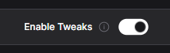
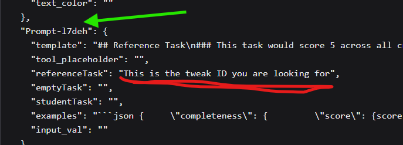

# 📝 Assessment Bot Configuration Options

- [📝 Assessment Bot Configuration Options](#-assessment-bot-configuration-options)
  - [📂 Where to Find the Settings](#-where-to-find-the-settings)
  - [⚙️ The Options](#️-the-options)
    - [🌐 Langflow Tab](#-langflow-tab)
      - [🔑 Langflow API Key](#-langflow-api-key)
      - [🌍 Langflow URL](#-langflow-url)
    - [🧩 Tweak IDs](#-tweak-ids)
      - [📝 Text Assessment Tweak ID](#-text-assessment-tweak-id)
      - [📊 Table Assessment Tweak ID](#-table-assessment-tweak-id)
      - [🖼️ Image Assessment Tweak ID](#️-image-assessment-tweak-id)
      - [🏷️ Image Flow UID](#️-image-flow-uid)
  - [🧩 Advanced Options Tab](#-advanced-options-tab)
    - [📦 Batch Size](#-batch-size)
    - [🔗 Update Details URL](#-update-details-url)
    - [🗂️ Assessment Record Template ID](#️-assessment-record-template-id)
    - [📁 Assessment Record Destination Folder](#-assessment-record-destination-folder)
    - [⏳ Days Until Auth Revoke](#-days-until-auth-revoke)
  - [🐞 Debug Tab](#-debug-tab)
    - [🏫 Classroom](#-classroom)

## 📂 Where to Find the Settings

1. Open your **Admin sheet**.
2. Click **Assessment Bot** -> **Settings**.

## ⚙️ The Options

### 🌐 Langflow Tab

**Important:** Each of the Langflow configuration values is *required* for Assessment Bot to work.

#### 🔑 Langflow API Key

This authenticates you with the [Langflow backend](docs/setup/langflowDeployment/langflowDeployment.md).  
You can create one by opening the Langflow web interface and navigating to:  

**`Settings` ➡️ `Langflow API` ➡️ `➕ Add New`**

#### 🌍 Langflow URL

This is the base URL of your Langflow instance. Example:  
`https://langflow.yourdomain.com`

### 🧩 Tweak IDs

Langflow "tweaks" allow you to pass extra information to the backend for processing. Each tweak ID enables Assessment Bot to pass relevant data to a specific flow.

#### 📝 Text Assessment Tweak ID

To find it:  

1. Open the **Text Assessment** flow in Langflow.  
2. Click **API** in the top right-hand corner.  
3. Enable **Tweaks**.  
     
4. Go to the **cURL** tab and scroll to find the string:  
   > `referenceTask: This is the tweak ID you are looking for`  
5. Copy the `tweakId` (indicated by the green arrow) and paste it into the settings box.  
     

💡 **Tip:** The tweak ID will always be prefixed with `Prompt`.

#### 📊 Table Assessment Tweak ID

To find it:  

1. Open the **Table Assessment** flow in Langflow.  
2. Click **API** in the top right-hand corner.  
3. Enable **Tweaks**.  
     
4. Go to the **cURL** tab and scroll to find the string:  
   > `referenceTask: This is the tweak ID you are looking for`  
5. Copy the `tweakId` (indicated by the green arrow) and paste it into the settings box.  
     

💡 **Tip:** The tweak ID will always be prefixed with `Prompt`.

#### 🖼️ Image Assessment Tweak ID

To find it:  

1. Open the **Image Assessment** flow in Langflow.  
2. Click **API** in the top right-hand corner.  
3. Enable **Tweaks**.  
     
4. Go to the **cURL** tab and scroll to find the string:  
   > `"input_value": "This is the tweakID you are looking for"`  
5. Copy the `tweakId` (indicated by the green arrow) and paste it into the settings box.  
     

💡 **Tip:** The tweak ID will always be prefixed with `ChatInput`.

#### 🏷️ Image Flow UID

To upload images to Langflow, you need the UID of the **Image Assessment Flow**.

1. Open the **Image Assessment** flow in Langflow.  
2. Click **API** in the top right-hand corner.  
3. Go to the **Python API** tab.  
4. Find the line:  
   > `FLOW_ID = "THE-VALUE-YOU-NEED-IS-IN-THE-SPEECH-MARKS"`

Copy the value inside the quotation marks and paste it into the settings box.

---

## 🧩 Advanced Options Tab

These configuration values are *optional*, but you may wish to adjust them depending on your preferences.

### 📦 Batch Size

**Default:** 20  

This is the number of simultaneous requests Assessment Bot will make to the Langflow backend.  For my [Google Cloud Run configuration of Langflow](./langflowDeployment/langflowDeployment.md), a batch size of **20** offers the best balance between speed and avoiding timeouts.

### 🔗 Update Details URL

**Default:**  
  `https://raw.githubusercontent.com/h-arnold/AssessmentBot/refs/heads/main/src/frontend/UpdateManager/assessmentBotVersions.json`
  
This URL points to a JSON file that contains the Google Drive File IDs of the template admin and assessment record sheets.  
When you update or run Assessment Bot for the first time, it will copy the files found at these File IDs.  
If you're using a custom build of Assessment Bot, update this URL to point to your own file.

### 🗂️ Assessment Record Template ID

**Default:** The File ID of the Assessment Record for your current version (pulled from the **Update Details URL**).  

This template is used as the base for all Assessment Records.

### 📁 Assessment Record Destination Folder

**Default:** A folder named **`Assessment Records`** located in the same folder as your **Admin Sheet**.  

If you don't specify a folder when first opening the **Admin Sheet**, the script will automatically create the **`Assessment Records`** folder.

### ⏳ Days Until Auth Revoke

**Default:** 60 days  

When you update the **Admin Sheet**, its authentication is revoked as the final action before it's archived. Since it's not possible to revoke authentication for scripts outside of the currently running script, a time-based trigger is created for each **Assessment Record** to automatically revoke authentication after the specified number of days. This prevents archived Assessment Records from retaining permissions that could be exploited by malicious actors.

---

## 🐞 Debug Tab

This option allows the **Admin Sheet** to act as an **Assessment Record** for debugging purposes.  
Using this mode enables full use of the **App Script Debugger** for troubleshooting issues.

### 🏫 Classroom

Select the classroom you want the **Admin Sheet** to simulate as an **Assessment Record**.