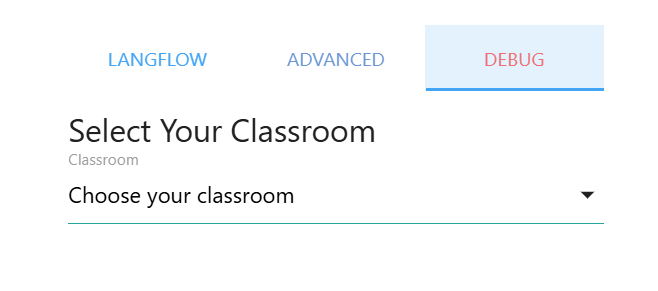
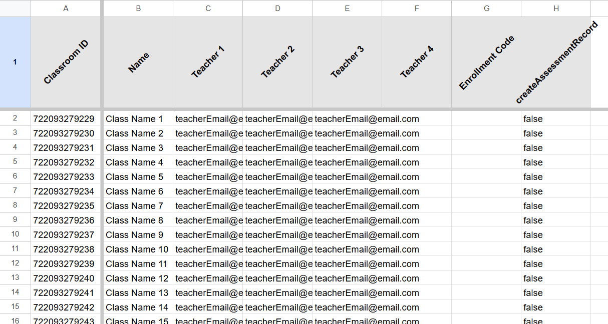
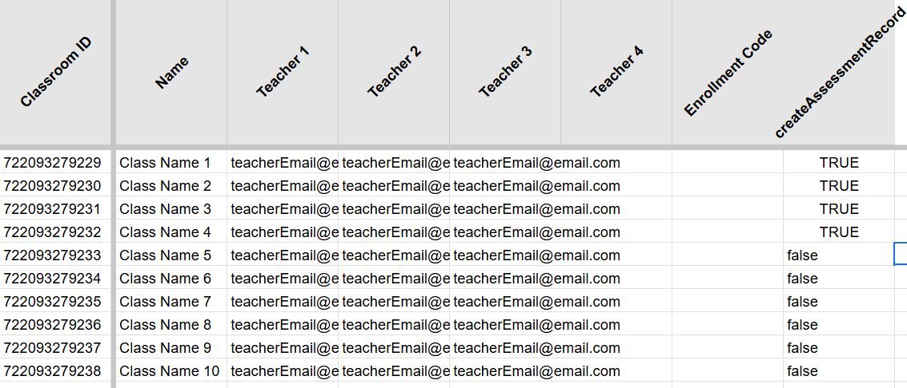
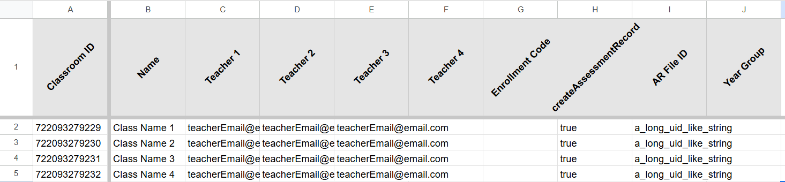

# 📚 Create Classroom Assessment Records

## 📄 Overview

This guide explains how to create Assessment Records using Assessment Bot. These records allow you to track the progress of all students in a selected class and form the core of the tool.

---

## 🚀 Quickstart

To quickly test Assessment Bot, set up the Admin Sheet as an Assessment Record:

1. Click `Assessment Bot` ➡️ `Settings` ➡️ `Debug`.
2. Select a class you wish to test.

  

---

## 📒 Creating the Assessment Records

### ✅ Prerequisites

- You have [deployed Langflow](./langflowDeployment/langflowDeployment.md).
- You have [configured Assessment Bot](./configOptions.md).
- You have at least one Google Classroom associated with the account running Assessment Bot.

⚠️ **Note**: While the ability to create Google Classrooms exists, it has not been tested since merging functionality from [here](https://github.com/h-arnold/googleClassroomOrganiser). Use at your own risk.

---

### 🪜 Steps to Follow

1. Click `Assessment Bot` ➡️ `Google Classrooms` ➡️ `Fetch Google Classrooms`.

   All going well, you should now see a `Classrooms` tab that looks similar to this:

   

2. In the `createAssessmentRecord` column, enter `TRUE` for the classes you want to generate Assessment Records for. For example:

   

3. Click `Assessment Bot` ➡️ `Google Classrooms` ➡️ `Create Assessment Records`.

   A progress modal should appear as your records are created. Once complete, your `Classrooms` sheet will look like this:

   

4. Populate the `Year Group` column with the appropriate number for each class. This enables the generation of the year group overview.

5. Navigate to your Assessment Records folder, open a record, and [start assessing!](/docs/howTos/README.md)

---

💡 **Tip**: Make sure to thoroughly test each step in a safe environment before rolling out to a wider set of classrooms.
